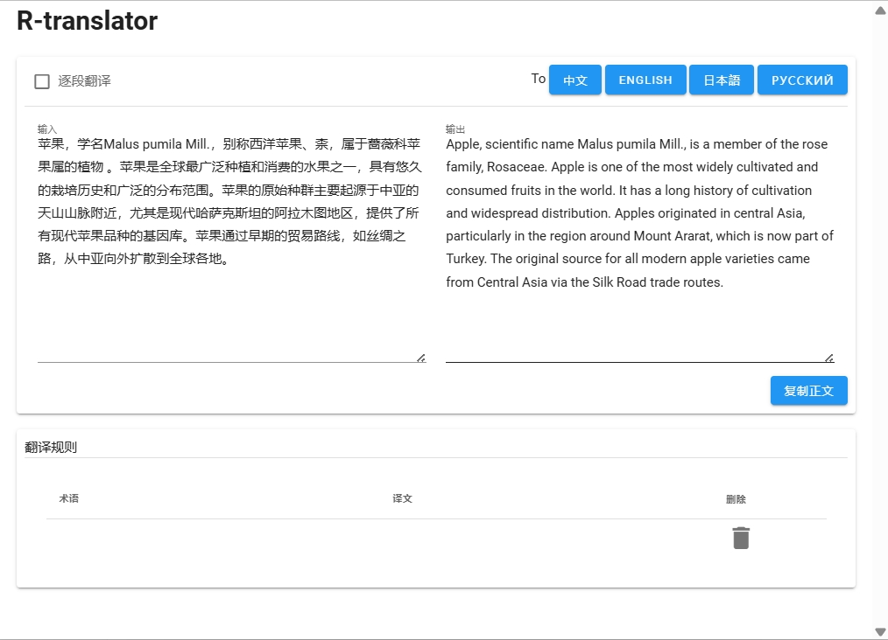

# R-translator

基于Vue.js和Vuetify构建的网页翻译应用，使用AI00 api。

网盘下载带rwkv_v7_0.4b模型的懒人包:https://pan.baidu.com/s/1lKIX0_4FutRbu3yx6p17Zw?pwd=7e2z
## 功能特性

- 多语言翻译（中文、英文、日文、俄文）
- 逐段翻译模式
- 自定义翻译规则/术语
- 复制翻译文本到剪贴板
- 翻译历史记录
- 响应式网页界面

## 使用方法

1. 在左侧文本框中输入文本
2. 选择目标语言：
   - 中文
   - English
   - 日本語
   - Русский
3. 点击对应的语言按钮进行翻译
4. 使用"逐段翻译"模式处理长文本
5. 翻译结果将显示在右侧文本框
6. 点击"复制正文"复制翻译结果

## 自定义翻译规则

1. 在"翻译规则"部分：
2. 在表格中添加新术语：
   - 左列：原文术语
   - 右列：翻译结果
3. 术语会自动保存
4. 点击垃圾桶图标删除规则

## 技术细节

- 基于Vue.js 2.x构建
- 使用Vuetify UI组件
- 响应式设计，支持移动/桌面设备
- 使用localStorage保存翻译规则

## 系统要求

- 现代浏览器（Chrome、Firefox、Edge）
- 需要网络连接以使用翻译服务

[English Version](README.md)